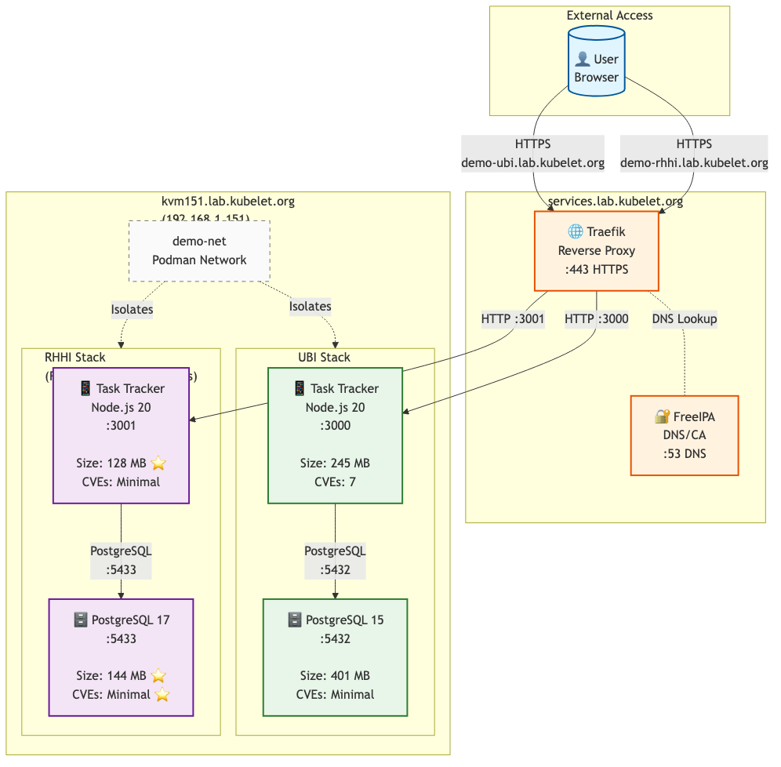

# Container build pipeline demo
## Three RHEL deployment paradigms

<div style="position: absolute; bottom: 20px; right: 20px; font-size: 0.6em; color: #888;">
Version 1.0 | 2026-06-18
</div>

---

## Today's agenda

- What we built
- Security-first pipeline
- Three approaches: UBI vs RHHI vs bootc
- Results and trade-offs
- Live demo
- Questions

**Time:** 30-45 minutes

---

## What we built

**Simple task tracker application**

- Node.js 20 + Express.js frontend
- PostgreSQL database backend
- CRUD operations (create, read, update, delete tasks)

**Built three ways to demonstrate RHEL's deployment ecosystem:**

- **UBI** - RHEL Universal Base Images (enterprise containers)
- **RHHI** - Red Hat Hardened Images (distroless containers)
- **bootc** - Image Mode (bootable OS images)

**Purpose:** Demonstrate security-first pipelines across all three modern RHEL deployment tracks

---

## System architecture

<div style="text-align: center;">



</div>

**Three deployment tracks - this demo covers tracks 1 & 2:**

1. **Container-native** - UBI & RHHI (Podman + systemd quadlets)
2. **Image mode / bootc** - Bootable OS images (immutable infrastructure)
3. **Traditional** - RPM packages (legacy approach)

**Same application, three deployment models, one security pipeline**

---

## Security-first build pipeline

**Every build goes through automated security gates:**

- Multi-stage build (build tools stay out of production)
- npm audit (fails on HIGH/CRITICAL vulnerabilities)
- Multi-architecture (AMD64 + ARM64 support)
- Trivy secret scan (detects hardcoded credentials, fails build)
- Trivy CVE scan (post-build vulnerability scanning)
- SBOM generation (supply chain transparency)

**Philosophy:** Security is not optional, it's automated in the build process

---

## Local vs CI/CD: Two build pipelines

| Feature | Local pipeline | CI/CD pipeline |
|---------|----------------|----------------|
| **Execution** | Manual `make ubi` | Automatic on git push |
| **Speed** | ~10 minutes (local resources) | ~12 minutes (GitHub runners) |
| **Security gates** | npm audit, Trivy, SBOM | npm audit, Trivy, SBOM |
| **Dashboard** | Terminal output | GitHub Security tab |
| **Team visibility** | Local only | All team members |
| **Offline capable** | Yes | No (requires internet) |
| **Cost** | Free (local CPU) | GitHub Actions minutes |

**Workflow comparison:**

- **Local:** Pre-commit hooks → Build → Scan → Deploy → Test (fast iteration)
- **CI/CD:** Git push → Matrix build → Scan → SARIF upload → Registry push (consistent, automated)

**Best practice:** Use local for development, CI/CD for validation and releases

---

## Security gates example

```bash
# Gate 1: npm audit (fails on HIGH/CRITICAL)
RUN npm audit --production --audit-level=high || \
    (echo "ERROR: Vulnerabilities found" && exit 1)

# Gate 2: Secret scan (fails on secrets found)
trivy image --scanners secret ghcr.io/demo:latest

# Gate 3: CVE scan (reports but doesn't block)
trivy image --severity HIGH,CRITICAL ghcr.io/demo:latest

# Gate 4: SBOM generation
trivy image --format cyclonedx --output sbom.json
```

**Result:** Only secure images without secrets reach production

---

## UBI: RHEL Universal Base Images

**What is UBI?**

- RHEL 7, 8, 9, 10 base images
- Three flavors: Standard, Minimal, Micro (distroless)
- Package manager: microdnf (minimal) or none (micro)
- Enterprise support, 10-year lifecycle per version
- Use case: Production, regulated industries

**Strengths:**

- Enterprise support (Red Hat backing)
- Stability (10-year lifecycle)
- Compliance (FIPS, Common Criteria)
- Tooling (package manager, debugging tools)

---

## UBI: RHEL Universal Base Images

**Trade-offs:**

- Larger size (more packages = bigger images)
- More CVEs (package manager adds attack surface)

**Best for:**

- Production applications
- Regulated industries (finance, healthcare)
- Large organizations with Red Hat partnerships
- Teams new to containers

---

## RHHI: Red Hat Hardened Images

**What is RHHI?**

- Fedora RHHI (minimal distroless)
- No package manager (distroless design)
- Community-supported, rolling releases
- Use case: Microservices, security-first apps

**Strengths:**

- Minimal attack surface (no shell, no package manager)
- Smaller size (58% reduction vs UBI)
- Fewer CVEs (distroless = minimal vulnerabilities)
- Modern stack (PostgreSQL 17 vs 15)

---

## RHHI: Red Hat Hardened Images

**Trade-offs:**

- No shell (harder to debug)
- No package manager (everything via multi-stage builds)
- Community support (no enterprise SLA)

**Best for:**

- Security-critical applications
- Microservices architecture
- Edge computing and IoT
- Bandwidth-constrained environments

---

## bootc: Image mode / bootable containers

**What is bootc?**

- Bootable OS image (not just an app container)
- RHEL 9 Image Mode bootc base
- Deployment: bare metal or VM (boots as the OS)
- Use case: appliances, edge devices, immutable infrastructure

**Strengths:**

- Immutable infrastructure (OS + app versioned together)
- Atomic updates with rollback
- Edge ready (single image for remote systems)
- Full system isolation

**Trade-offs:**

- Large size (~1-2 GB, full OS)
- Requires reboot for updates
- Not multi-tenant (one OS per system)

**Best for:**

- Edge deployments (remote, single-purpose systems)
- Appliances (kiosks, IoT gateways)
- Immutable infrastructure requirements

---

## Three-way comparison

| Feature | UBI | RHHI | bootc |
|---------|-----|------|-------|
| Type | App container | App container | Bootable OS |
| Base OS | RHEL 7-10 | Fedora (RHHI) | RHEL 9 Image Mode |
| Total size | 645 MB | **276 MB** (58% smaller) | ~1-2 GB |
| CVEs | Moderate | **Minimal** | Moderate |
| Package manager | microdnf | None | None (immutable) |
| Shell access | bash | None | SSH (post-boot) |
| Deployment | Podman | Podman | Bare metal / VM |
| Updates | Pull + restart | Pull + restart | bootc + reboot |
| Support | Enterprise | Community | Enterprise (RHEL) |
| Lifecycle | 10 years/version | Rolling | 10 years |
| Multi-app | Yes | Yes | No |
| Best for | General apps | Microservices | Edge / appliances |

---

## When to choose UBI

**Choose UBI when you need:**

- Enterprise support (Red Hat SLA and support contracts)
- Compliance requirements (FIPS 140-2, Common Criteria)
- Long-term stability (10-year lifecycle guarantees)
- Debugging tools (shell access, package manager)
- Team familiarity (standard RHEL tooling)

---

## When to choose RHHI

**Choose RHHI when you need:**

- Minimal attack surface (security-first architecture)
- Smaller images (faster deployments, less bandwidth)
- Modern stack (latest software versions)
- Cloud-native (Kubernetes, microservices)

---

## When to choose bootc

**Choose bootc when you need:**

- Immutable infrastructure (OS + app as single artifact)
- Edge deployments (remote, single-purpose systems)
- Appliances (kiosks, IoT gateways, embedded systems)
- Atomic updates (full system rollback capability)

---

## Real results

**UBI stack:**
- Build time: ~8 minutes (multi-arch)
- Total size: 645 MB (webapp + database)
- CVEs: 7 (webapp), Minimal (database)

**RHHI stack:**
- Build time: ~6 minutes (multi-arch)
- Total size: 276 MB (58% smaller)
- CVEs: Minimal (distroless)

**bootc image:**
- Build time: ~11 minutes (AMD64)
- Total size: ~1-2 GB (full OS + app)
- CVEs: Moderate (full OS)

**Key insight:** Choose based on deployment model, not just size

---

## Live demo

**Live dashboard: http://localhost:8888**

Watch all three paradigms build in parallel

**One command:**

```bash
make demo  # Dashboard + parallel builds
```

**What you'll see:**

- Real-time build progress (init → build → scan)
- Three columns: UBI, RHHI, bootc
- Live log streaming
- Duration tracking
- Success/failure status

---

## Key takeaways

- **Three paradigms** - UBI (enterprise), RHHI (distroless), bootc (immutable OS)
- **Security first** - Same security pipeline for all three tracks
- **Right tool for job** - Containers for apps, bootc for appliances
- **Size vs scope** - RHHI smallest (276 MB), bootc largest (~2 GB) but includes OS
- **Multi-arch** - UBI and RHHI support AMD64 + ARM64
- **Live dashboard** - Parallel builds with real-time progress

**The future:** Red Hat's multi-modal deployment ecosystem

---

## Resources

**Demo repository:**

- GitHub: `jkirklan/homelab/demo/`
- Includes: Containerfiles, build scripts, deployment configs

**Documentation:**

- Build pipeline diagrams
- Security scanning guides
- Deployment procedures
- Test results

**Get started:**

```bash
git clone https://github.com/jkirklan/homelab.git
cd homelab/demo/
make ubi     # Build UBI stack
make rhhi    # Build RHHI stack
make bootc   # Build bootc image
make demo    # Dashboard + parallel builds
```

---

## Questions?

**Happy to discuss:**

- Security scanning strategies
- Container optimization techniques
- Multi-architecture builds
- UBI vs RHHI trade-offs
- Podman + systemd deployment
- Anything else

**Contact:** Available after the presentation

---

# Thank you
## Security-first container builds

**Remember:**

- Automate security scanning
- Choose the right base for your needs
- Build multi-arch from the start
- Test your builds locally

**Demo:** http://192.168.1.151:3001

**Questions:** Let's discuss
