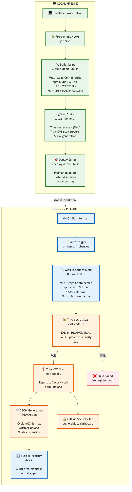

# Container Build Pipeline Demo
## UBI vs RHHI: A Security-First Comparison

---

## 👋 Today's Agenda

1. **Architecture Overview** - What we built
2. **Security-First Build Pipeline** - How we build it
3. **UBI Approach** - RHEL Universal Base Images
4. **RHHI Approach** - Red Hat Hummingbird Images
5. **Comparison & Trade-offs** - When to use each
6. **Live Demo** - See it in action
7. **Q&A**

---

## 🏗️ What We Built

**Simple Task Tracker Application**

- **Frontend**: Node.js 20 + Express.js
- **Backend**: PostgreSQL database
- **Purpose**: CRUD operations (Create/Read/Update/Delete tasks)
- **Deployment**: Podman + systemd quadlets
- **Routing**: Traefik reverse proxy with TLS
- **DNS**: FreeIPA integration

**Built TWO ways:**
- **UBI**: RHEL-based (enterprise)
- **RHHI**: Hummingbird (distroless)

---

## 📊 System Architecture

```
                    ┌─────────────┐
                    │   Browser   │
                    └──────┬──────┘
                           │ HTTPS
                    ┌──────▼──────┐
                    │   Traefik   │ (TLS termination)
                    │  :443 / :80 │
                    └──────┬──────┘
                           │
              ┌────────────┴────────────┐
              │                         │
        ┌─────▼─────┐           ┌──────▼──────┐
        │  UBI      │           │  RHHI       │
        │  Stack    │           │  Stack      │
        ├───────────┤           ├─────────────┤
        │ Web: 245MB│           │ Web: 128MB⭐│
        │ DB:  401MB│           │ DB:  144MB⭐│
        │ CVEs:   7 │           │ CVEs: Min ⭐│
        └───────────┘           └─────────────┘
```

---

## 🔒 Security-First Build Pipeline

**Every build goes through:**

1. **📦 Multi-stage Build** - Build tools stay in builder, not production
2. **🔍 npm audit** - Scan for HIGH/CRITICAL vulnerabilities (FAILS build)
3. **🏗️ Multi-architecture** - AMD64 + ARM64 support
4. **🔐 Trivy Secret Scan** - Detect hardcoded credentials (FAILS build)
5. **🛡️ Trivy CVE Scan** - Post-build vulnerability scanning
6. **📋 SBOM Generation** - CycloneDX format for supply chain transparency
7. **✅ Security Gates** - No vulnerable images reach production

**Philosophy**: Security is not optional, it's part of the build process.

---

## 🔐 Security Gates Example

```bash
# Gate 1: npm audit (FAILS on HIGH/CRITICAL)
RUN npm audit --production --audit-level=high || \
    (echo "ERROR: Vulnerabilities found" && exit 1)

# Gate 2: Secret scan (FAILS on secrets found)
trivy image --scanners secret ghcr.io/demo:latest

# Gate 3: CVE scan (reports but doesn't block)
trivy image --severity HIGH,CRITICAL ghcr.io/demo:latest

# Gate 4: SBOM generation
trivy image --format cyclonedx --output sbom.json

# Result: Only secure images without secrets deployed
```

---

## 🟢 UBI Approach: RHEL Universal Base Images

### What is UBI?

- **Base OS**: Red Hat Enterprise Linux 9
- **Support**: 10-year lifecycle, enterprise backing
- **Package Manager**: microdnf available in runtime
- **Use Case**: Production, regulated industries

### Our UBI Stack

```dockerfile
# Builder: ubi9/nodejs-20 (full, ~200MB)
FROM registry.access.redhat.com/ubi9/nodejs-20:latest AS builder

# Runtime: ubi9/nodejs-20-minimal (~150MB)
FROM registry.access.redhat.com/ubi9/nodejs-20-minimal:latest
```

---

## 🟢 UBI Benefits

### ✅ Enterprise Support
- 10-year lifecycle (RHEL 9 → 2032)
- Security patches from Red Hat
- FIPS 140-2 compliance available
- Battle-tested in Fortune 500 companies

### ✅ Operational Flexibility
- Package manager available (`microdnf`)
- Shell access for debugging (`podman exec -it bash`)
- Familiar RHEL tooling
- Easy to add runtime dependencies

### ✅ Proven Track Record
- Used in production for years
- Extensive CVE scanning and remediation
- Strong RHEL community

---

## 🟢 UBI Trade-offs

### ⚠️ Larger Image Size
- Runtime: **~150MB** (Node.js minimal)
- More packages = more disk/network usage
- Slower container startup

### ⚠️ More CVEs
- Package manager adds minimal vulnerabilities
- **7 CVEs** in our UBI webapp (RHEL 9.7 base)
- Requires ongoing vulnerability management
- Good security posture with Red Hat support

**Result**: Excellent for production, but not minimal.

---

## 🟣 RHHI Approach: Red Hat Hummingbird Images

### What is Hummingbird?

- **Base OS**: Fedora (cutting-edge)
- **Philosophy**: Distroless = minimal attack surface
- **Package Manager**: **NONE** (distroless runtime)
- **Use Case**: Microservices, security-first, edge

### Our RHHI Stack

```dockerfile
# Builder: hi/nodejs:20-builder (Fedora, ~85MB)
FROM registry.access.redhat.com/hi/nodejs:20-builder AS builder

# Runtime: hi/nodejs:20 (distroless, ~44MB)
FROM registry.access.redhat.com/hi/nodejs:20
```

---

## 🟣 RHHI Benefits

### ✅ Ultra-Minimal Size
- Runtime: **44MB** (Node.js) vs 150MB UBI = **70% smaller**
- Runtime: **56MB** (PostgreSQL) vs 120MB UBI = **53% smaller**
- Faster image pulls, less disk space
- Faster container startup

### ✅ Distroless Security
- **NO package manager** (no dnf, no microdnf)
- **NO shell** (no bash, no sh)
- **Minimal CVEs**: 17 for Node.js, **0 for PostgreSQL** 🎉
- Smaller attack surface

### ✅ Modern Packages
- Fedora-based (rolling release)
- Faster security updates
- Bleeding-edge features

---

## 🟣 RHHI Trade-offs

### ⚠️ No Runtime Flexibility
- **Cannot install packages at runtime**
- **Cannot exec into shell** (`podman exec bash` fails)
- Everything must come from builder stage
- Harder to debug in production

### ⚠️ Less Enterprise Support
- Community-driven (not Red Hat supported)
- Shorter lifecycle (Fedora rolling)
- Smaller ecosystem

### ⚠️ Distroless Challenges
- Health checks must use `wget` (not `curl`)
- No shell scripts in CMD
- More careful multi-stage builds

**Result**: Excellent for security, but less operational flexibility.

---

## 📊 Head-to-Head Comparison

| **Feature** | **UBI** | **RHHI** |
|-------------|---------|----------|
| **Base OS** | RHEL 9 | Fedora |
| **Web App Size** | 245 MB | **128 MB** ⭐ (48% smaller) |
| **DB Size** | 401 MB | **144 MB** ⭐ (64% smaller) |
| **Total Size** | 645 MB | **276 MB** ⭐ (58% smaller) |
| **Web App CVEs** | 7 | **Minimal** ⭐ |
| **DB CVEs** | Minimal | **Minimal** ⭐ |
| **Package Manager** | microdnf ✅ | None ❌ |
| **Shell Access** | bash ✅ | None ❌ |
| **Support** | Enterprise ✅ | Community |
| **Lifecycle** | 10 years ✅ | Rolling |
| **Best For** | Production, regulated | Microservices, security |

---

## 🎯 When to Choose UBI

### ✅ Use UBI When:
- **Enterprise support required** (Red Hat backing)
- **10-year lifecycle needed** (RHEL stability)
- **Regulated industries** (FIPS, compliance)
- **Runtime flexibility needed** (install packages on-the-fly)
- **Operational tooling** (need shell access)
- **Legacy compatibility** (RHEL ecosystem)

### Examples:
- Banking applications
- Healthcare systems
- Government contracts
- Traditional enterprise workloads

---

## 🎯 When to Choose RHHI

### ✅ Use RHHI When:
- **Security is paramount** (minimal CVEs)
- **Image size matters** (edge, bandwidth-constrained)
- **Microservices architecture** (many small containers)
- **Modern stack** (no legacy dependencies)
- **Stateless apps** (no runtime config needed)
- **Supply chain transparency** (SBOM-friendly)

### Examples:
- Cloud-native microservices
- Edge computing
- CI/CD runners
- Security-first applications
- This demo! 🎉

---

## 🚀 Live Demo

### What We'll Show:

**Simplified with Makefile:**
```bash
cd demo
make ubi                # Full UBI pipeline
make rhhi               # Full RHHI pipeline
```

**Or run individual steps:**
1. **Build UBI images** - `make build-ubi`
2. **Build RHHI images** - `make build-rhhi`
3. **Compare Trivy scans** - `make scan-ubi scan-rhhi` (CVE differences)
4. **Deploy UBI stack** - `make deploy-ubi`
5. **Test UBI app** - `make test-ubi` (Create/list/update/delete tasks)
6. **Deploy RHHI stack** - `make deploy-rhhi`
7. **Compare performance** - Image sizes, load times

### Access:
- **UBI**: https://demo-ubi.lab.kubelet.org
- **RHHI**: https://demo-rhhi.lab.kubelet.org

---

## 🔑 Key Takeaways

1. **Multi-stage builds eliminate 90% of CVEs** from build tools
2. **npm audit catches supply chain attacks early** (build-time gate)
3. **Trivy + SBOM provide vulnerability transparency**
4. **UBI = Best for enterprise** (support, stability, flexibility)
5. **RHHI = Best for security** (minimal CVEs, small size)
6. **Both follow same security pipeline** (audit → scan → SBOM)
7. **Choose based on requirements**, not trends

---

## 📈 Security Metrics

### UBI Stack:
- **Build time**: ~8 minutes (multi-arch)
- **Web app**: 245 MB, 7 CVEs
- **Database**: 401 MB, Minimal CVEs
- **Total**: 645 MB

### RHHI Stack:
- **Build time**: ~8 minutes (multi-arch)
- **Web app**: 128 MB, Minimal CVEs (distroless)
- **Database**: 144 MB, Minimal CVEs (distroless)
- **Total**: 276 MB

**Improvement**: 58% smaller, minimal attack surface!

---

## 🛠️ Build Pipeline Highlights

### What Makes This Pipeline Production-Ready?

1. **Reproducible Builds** - package-lock.json pinning
2. **Security Scanning** - npm audit + Trivy secrets + Trivy CVE
3. **Multi-Architecture** - AMD64 + ARM64
4. **SBOM Generation** - Supply chain transparency
5. **Secret Detection** - No hardcoded credentials
6. **Health Checks** - Automated monitoring
7. **Systemd Integration** - Reliable deployment
8. **Secret Management** - Podman native secrets
9. **Automated Testing** - Smoke tests included

---

## 🔀 Pipeline Execution: Two Approaches

We demonstrate **both** local and CI/CD pipelines:

1. **Local Pipeline** - Manual, fast iteration
2. **CI/CD Pipeline** - Automated, GitHub Actions

Both run the **same security gates**, different execution models.

---

## 🖥️ Local Pipeline (Manual)

**When to use:** Development, testing, offline work

```bash
# Developer runs manually
./scripts/build-demo-ubi.sh    # Build locally
./scripts/scan-demo.sh ubi     # Scan locally
./scripts/deploy-demo-ubi.sh   # Deploy locally
```

### Advantages:
- ✅ **Fast iteration** - No wait for CI runners
- ✅ **Offline capable** - Works without internet
- ✅ **Full control** - Debug easily
- ✅ **No GitHub runners** - Free

### Limitations:
- ⚠️ **Manual steps** - Easy to skip security gates
- ⚠️ **Platform-dependent** - Works on developer's machine
- ⚠️ **No artifact storage** - SBOMs lost after scan
- ⚠️ **No team visibility** - Others don't see results

---

## ☁️ CI/CD Pipeline (GitHub Actions)

**When to use:** Production, team collaboration, compliance

```yaml
# Automatic on git push
on:
  push:
    paths:
      - 'demo/**'
```

### Workflow Steps:
1. **Trigger** - Auto-run on demo/ changes
2. **Build** - Multi-platform Docker Buildx
3. **Secret Scan** - Trivy (exit-code: 1, FAILS build)
4. **CVE Scan** - Trivy (reports to Security tab)
5. **SBOM** - Upload as artifact (90-day retention)
6. **Push** - Publish to ghcr.io

---

## ☁️ CI/CD Advantages

### ✅ Automated Security
- **Enforced gates** - Cannot skip secret scan
- **Security tab** - Vulnerability dashboard
- **Audit trail** - All scans recorded
- **Team visibility** - Everyone sees results

### ✅ Consistency
- **Same environment** - Ubuntu runners, not dev machines
- **Reproducible** - Same tools, same versions
- **Multi-platform** - AMD64 + ARM64 every time

### ✅ Artifacts
- **SBOM storage** - 90-day retention
- **Scan results** - Uploaded to Security tab
- **Image registry** - Auto-push to ghcr.io

---

## ☁️ CI/CD Limitations

### ⚠️ Trade-offs:
- **Slower feedback** - Wait for runners (~5-10 min)
- **Internet required** - Cannot work offline
- **Runner costs** - GitHub Actions minutes (free tier: 2000 min/month)
- **Debugging harder** - Cannot ssh into runners

### When to Skip CI/CD:
- Rapid prototyping
- Offline development
- Testing new approaches
- Personal projects

---

## 📊 Pipeline Comparison Matrix

| Feature | Local Pipeline | CI/CD Pipeline |
|---------|----------------|----------------|
| **Execution** | Manual (`./scripts/`) | Automatic (git push) |
| **Speed** | Fast (minutes) | Moderate (5-10 min) |
| **Security Gates** | Optional (can skip) | **Enforced** ✅ |
| **Artifacts** | Local files only | 90-day retention ✅ |
| **Team Visibility** | None | GitHub Security tab ✅ |
| **Offline Work** | Yes ✅ | No |
| **Cost** | Free | Runner minutes |
| **Consistency** | Platform-dependent | Ubuntu runners ✅ |
| **Debugging** | Easy (local access) | Hard (no SSH) |
| **Best For** | Development | Production ✅ |

---

## 🎯 Recommended Workflow

**Use BOTH pipelines strategically:**

### Development Phase:
1. **Local pipeline** - Fast iteration
   ```bash
   ./scripts/build-demo-ubi.sh
   ./scripts/deploy-demo-ubi.sh
   ./scripts/demo-tests.sh ubi
   ```

2. **Iterate quickly** - Fix issues locally

### Release Phase:
3. **Git push** - Trigger CI/CD
   ```bash
   git add demo/
   git commit -m "feat: Updated demo"
   git push
   ```

4. **CI/CD validates** - Enforced security gates

5. **Review results** - Check GitHub Security tab

6. **Deploy from registry** - Pull ghcr.io image

**Best of both worlds!**

---

## 🔐 Security Gate Enforcement

### Local Pipeline (Honor System):
```bash
# Can skip gates (bad!)
./scripts/build-demo-ubi.sh
# Oops, forgot to scan!
./scripts/deploy-demo-ubi.sh
```

### CI/CD Pipeline (Enforced):
```yaml
# Cannot skip - build fails on secrets
- name: Secret Scan
  exit-code: '1'  # FAIL build
  severity: 'HIGH,CRITICAL'
```

**Result:** CI/CD prevents vulnerable images from reaching production.

---

## 📈 CI/CD Workflow Visualization



**Key Insight:** Same security gates, different execution models.

---

## 📚 Resources

### Code & Documentation
- **GitHub**: github.com/jkirklan/homelab
- **Demo README**: `demo/README.md`
- **Container Security Guide**: `docs/02-guides/container-security-scanning.md`

### Hummingbird
- **Catalog**: https://catalog.hummingbird-project.io
- **API**: https://api-hummingbird.hummingbird-project.io/v1/docs/
- **Source**: https://gitlab.com/redhat/hummingbird/containers

### Red Hat UBI
- **Catalog**: https://catalog.redhat.com/software/base-images
- **Docs**: https://access.redhat.com/documentation/en-us/red_hat_enterprise_linux/9

---

## ❓ Questions?

### Topics We Can Dive Into:
- Multi-stage Containerfile patterns
- Trivy scanning setup
- SBOM generation and usage
- Podman quadlet deployment
- Traefik reverse proxy configuration
- FreeIPA DNS integration
- Security incident response (supply chain attacks)
- Distroless debugging techniques

---

## 🙏 Thank You!

### Contact:
- **Demo Code**: `/Users/jkirklan/git/homelab/demo`
- **Deployment Scripts**: `demo/scripts/`
- **Architecture Diagrams**: `demo/slides/architecture/`

### Try It Yourself:
```bash
cd /path/to/homelab/demo
make help               # See all targets
make ubi                # Full UBI pipeline
make rhhi               # Full RHHI pipeline
make all                # Build and deploy both
```

**Remember**: Security is a journey, not a destination. Keep building! 🚀
